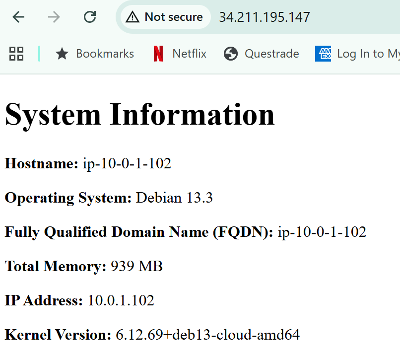

# acit4640_lab-wk7
# Allison Chen A01379601

## create new keys

### Create a new SSH key pair named `aws` in the ~/.ssh directory:
```bash
ssh-keygen -t ed25519 -f ~/.ssh/aws -C "aws"
```

## Run included scripts to import and delete keys

### Import new key
```bash
./scripts/import_lab_key ~/.ssh/aws.pub
```

### Delete new key
```bash
./scripts/delete_lab_key
```


## Rerraform commands
### Download provides and initialize 

```bash
terraform init
```

### Check code follow the formatting

```bash
terraform fmt
```

### Check for syntax and errors

```bash
terraform validate
```

### Preview what infrastructure will create

```bash
terraform plan
```

### apply terraform config

```bash
terraform apply
```

## ansible commands
### Syntax check - check any errors before run it

```bash
ansible-playbook --syntax-check -i inventory/hosts.yml playbook.yml
```

### Run playbook - execute the config tasks

```bash
ansible-playbook -i inventory/hosts.yml playbook.yml
```

## Screenshot



## cleanup
### destroy terraform

```bash
terraform destory
```


